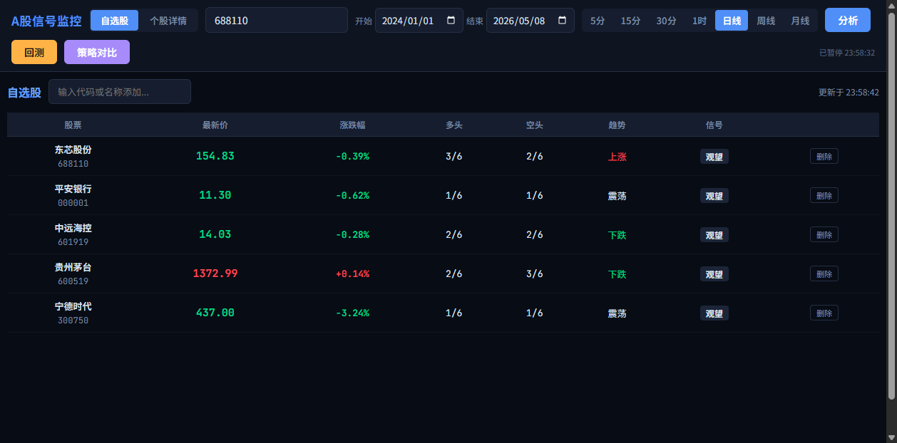
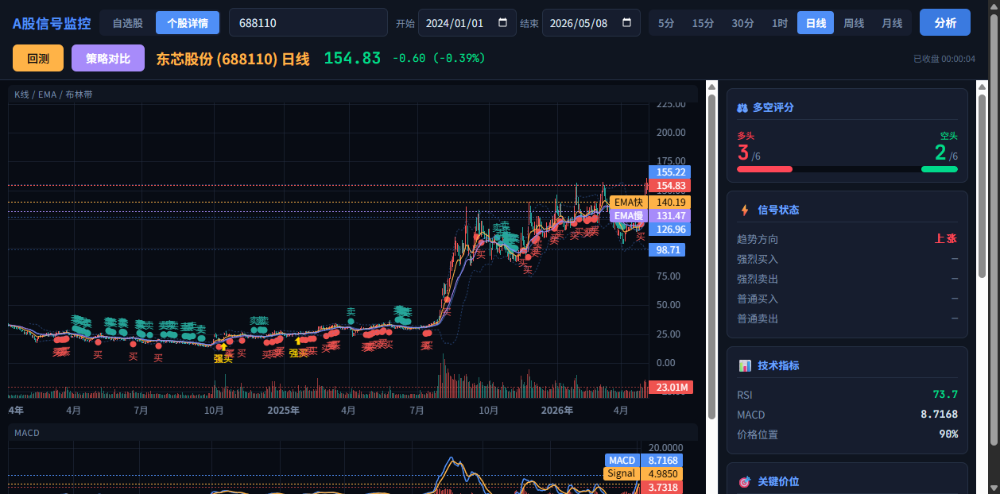
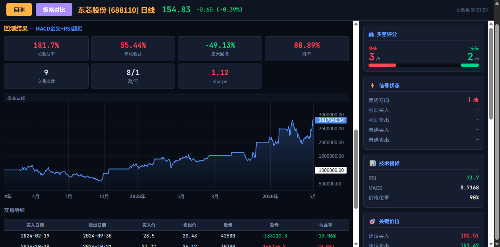
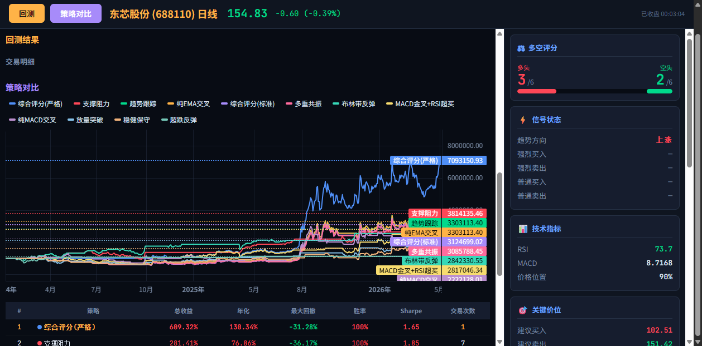

# A股多空信号监控系统

> **如果这个项目对你有一丁点帮助，求求点个 ⭐ Star 吧QAQ** 一个人写的项目真的很需要鼓励...clone 了一堆但是一个 star 都没有，我真的会伤心的好吗！
>
> **求廉价云服务器！** 为了让手机随时随地能用，不想每次都得开电脑跑程序，有没有便宜好用的云服务器厂商推荐啊QAQ 学生党真的买不起贵的...
>
> **求交易策略大佬指点！** 我就一写代码的，对交易策略的理解还停留在金叉死叉的水平QAQ 如果有大佬懂更高级的策略思路（量价关系、因子分析之类的），求求教教我，直接提 issue/PR 感激不尽！
>
> **求学习机会！** 如果有大佬以这个项目为基础魔改出了更厉害的版本，拜托拜托一定让我知道让我去学习QAQ 可以 fork 后 @ 我，我一定认真学习！

实时A股技术分析、多空信号监控与策略回测系统。基于 Pine Script 指标逻辑移植到 Python，提供 Web GUI 界面，支持 Windows 一键运行。

## 截图预览

### 自选股总览


### 个股详情分析


### 回测结果 + 权益曲线


### 策略对比


## 快速开始

### Windows 用户（推荐）

1. 从 [Releases](https://github.com/whiteicey/quant-monitor/releases) 下载 `A股信号监控-Windows-x64.zip`
2. 解压后双击 `A股信号监控.exe`
3. 浏览器自动打开，即可使用

### 手机用户

1. 电脑运行程序后，查看终端显示的局域网地址（如 `http://192.168.x.x:5000`）
2. 手机连接同一 WiFi，浏览器打开该地址
3. 点击浏览器菜单「添加到主屏幕」，获得类似 APP 的体验

### 从源码运行

```bash
git clone https://github.com/whiteicey/quant-monitor.git
cd quant-monitor
pip install -r requirements.txt
python app.py
```

## 功能

### 多资产配置（v2.0 新功能）
- **独立的[资产配置]页面**，支持ETF/个股/债券/贵金属/商品等多类资产
- **4套预设方案**: 经典三驾马车 / 全天候配置 / 高息防守 / 激进成长
- **可复制并修改预设**，自由增删资产创建自定义方案
- **6种配置策略**: 等权配置 / 动量轮动 / 均线过滤 / 风险平价 / 均值方差 / 自适应
- **智能建议**: 根据资产池自动推荐最优策略和再平衡频率，附带推荐理由
- **组合回测**: 权益曲线(vs等权基准) + 持仓权重变化表 + 8项统计指标
- **真实成本模型**: 佣金(万2.5) + 印花税(卖方0.05%,债券/货币免征) + 滑点

### 实时监控
- 实时行情每 5 秒自动刷新（新浪财经数据源）
- K线图、MACD、RSI 实时更新
- 多空评分、信号状态、关键价位实时重算
- 交易时段/收盘状态自动识别

### 技术指标
- **EMA** 快慢线 + 金叉/死叉
- **MACD** 双线 + 柱状图
- **RSI** 超买超卖
- **布林带** 上中下轨
- **KDJ** K/D/J三线 + 金叉/死叉 + 超买超卖
- **OBV** 能量潮 + 20日均线
- **VWAP** 成交量加权平均价（叠加在K线图上）
- **成交量** 放量分析
- **ATR** 波动率
- **支撑/阻力** 位识别

### K线周期
5分钟 / 15分钟 / 30分钟 / 1小时 / 日线 / 周线 / 月线

### 12 种回测策略 + 专业回测引擎

**v1.9.0 回测引擎全面重构**，修复前视偏差等6项关键问题，回测数据可信度大幅提升：

| 修复项 | 修复前 | 修复后 |
|--------|--------|--------|
| **成交价格** | 信号bar收盘价（前视偏差） | 下一bar开盘价 |
| **T+1规则** | 无限制 | 买入当日不能卖出 |
| **印花税** | 双边0.1% | 卖方单边0.05% |
| **佣金** | 固定费率 | 最低5元起 |
| **滑点** | 无 | 可配置（基点） |
| **回撤熔断** | 无 | 可配置（默认关闭） |

新增功能：
- **买入持有基准线**：回测曲线自动叠加 buy & hold 基准对比
- **样本外测试**：可设置后 N% 数据为测试集，检测策略过拟合

| 策略 | 说明 |
|------|------|
| MACD金叉+RSI超买 | 实测胜率最高，默认策略 |
| 稳健保守 | 多条件确认，适合稳健投资者 |
| 趋势跟踪 | EMA金叉+MACD确认，跟随趋势 |
| 多重共振 | 3个以上维度同时看多才买入 |
| 超跌反弹 | RSI超卖区抄底 |
| 布林带反弹 | 触下轨买入触上轨卖出 |
| 放量突破 | 放量上涨入场 |
| 支撑阻力 | 近支撑买入近阻力卖出 |
| 综合评分(标准) | 多空评分>=4触发 |
| 综合评分(严格) | 评分>=5且需金叉确认 |
| 纯MACD交叉 | 经典MACD金叉死叉 |
| 纯EMA交叉 | 经典EMA金叉死叉 |

### 13 套参数预设

每套参数基于多只股票实测数据优化，切换回测策略时自动匹配推荐预设：

- 默认参数（原始 Pine Script）
- MACD+RSI 优化（EMA 10/22，胜率 89%）
- 经典 MACD（12/26/9）
- 灵敏 MACD（8/17/9）
- 布林带窄幅/宽幅
- 趋势慢速/快速
- 稳健优化、超跌反弹优化、放量突破优化
- RSI 灵敏/平滑

所有参数均可手动调整，点击「分析」或「回测」按钮后立即生效。

### 7 种关键价位计算模式

每套参数预设自带专属的关键价位（买入/卖出/止损）计算逻辑，切换预设时自动切换：

| 模式 | 适用预设 | 买入参考 | 卖出参考 | 止损 |
|------|---------|---------|---------|------|
| default | 默认 | 当天最低价×0.98 | 当天最高价×1.02 | 收盘价×0.95 |
| macd_momentum | MACD系列 | 下轨 + 0.5×ATR | 上轨 - 0.5×ATR | 快EMA - 1.5×ATR |
| bollinger | 布林带系列 | 布林带下轨 | 布林带上轨 | 中轨与下轨中点 |
| atr_trend | 趋势系列 | 慢EMA - 0.5×ATR | 快EMA + 2×ATR | 慢EMA - 2×ATR |
| conservative | 稳健 | 中轨与下轨中点 | 中轨与上轨中点 | 现价 - 3×ATR |
| rsi_reversal | RSI/超跌系列 | 支撑位×1.01 | 阻力位×0.99 | 支撑位×0.97 |
| volume_break | 放量突破 | 阻力位×0.99 | 阻力位 + 2×ATR | 布林中轨 |

> **关于 default 模式**：经与 TradingView 实际输出逐一比对验证，TV 的 Pine Script 在 `barstate.islast` 执行时，`ta.lowest(low, 20)` / `ta.highest(high, 20)` 因历史数据加载不足实际退化为只取当天 bar 的值。为与 TV 保持一致，default 模式的买入/卖出参考价基于当天 K 线的最低价和最高价计算。

### 股票搜索
支持代码和名称模糊搜索，输入「茅台」或「600519」均可。

### 多数据源
东方财富 → 新浪财经 → 腾讯财经，自动切换，确保数据可用。

## 原始 Pine Script

本项目的信号系统移植自以下 TradingView Pine Script 指标：

<details>
<summary>点击展开 Pine Script 源码</summary>

```pine
//@version=5
indicator("东芯股份(688110)多空监控系统", shorttitle="688110 Monitor", overlay=true)

// 输入参数 - 针对A股特性优化
fastLength = input.int(6, "快速EMA周期")
slowLength = input.int(7, "慢速EMA周期")
signalLength = input.int(4, "信号线周期")
rsiLength = input.int(14, "RSI周期")
bbLength = input.int(20, "布林带周期")
bbMult = input.float(2.0, "布林带标准差倍数")
volumeLength = input.int(5, "成交量平均周期")
atrLength = input.int(14, "ATR周期")

// 移动平均线
fastEMA = ta.ema(close, fastLength)
slowEMA = ta.ema(close, slowLength)
emaBullish = fastEMA > slowEMA and close > fastEMA
emaBearish = fastEMA < slowEMA and close < fastEMA

// 金叉死叉判断
goldenCross = ta.crossover(fastEMA, slowEMA)
deathCross = ta.crossunder(fastEMA, slowEMA)

// MACD
[macdLine, signalLine, _] = ta.macd(close, fastLength, slowLength, signalLength)
macdHistogram = macdLine - signalLine
macdBullish = macdLine > signalLine and macdLine > 0
macdBearish = macdLine < signalLine and macdLine < 0
macdGoldenCross = ta.crossover(macdLine, signalLine)
macdDeathCross = ta.crossunder(macdLine, signalLine)

// RSI
rsi = ta.rsi(close, rsiLength)
rsiOverbought = rsi > 70
rsiOversold = rsi < 30
rsiBullish = rsi > 45 and rsi < 70 and rsi > rsi[1]
rsiBearish = rsi < 55 and rsi > 30 and rsi < rsi[1]

// 布林带
bbBasis = ta.sma(close, bbLength)
bbDev = bbMult * ta.stdev(close, bbLength)
bbUpper = bbBasis + bbDev
bbLower = bbBasis - bbDev
bbBullish = close > bbBasis and close < bbUpper
bbBearish = close < bbBasis and close > bbLower
nearBBLower = close <= bbLower * 1.02
nearBBUpper = close >= bbUpper * 0.98

// 成交量分析
volumeAvg = ta.sma(volume, volumeLength)
volumeHigh = volume > volumeAvg * 1.5
volumeBullish = volumeHigh and close > open and close > close[1]
volumeBearish = volumeHigh and close < open and close < close[1]

// ATR波动率
atr = ta.atr(atrLength)
highVolatility = atr > ta.sma(atr, 20) * 1.2

// 支撑阻力识别
resistance = ta.highest(high, 50)
support = ta.lowest(low, 50)
nearResistance = close >= resistance * 0.985
nearSupport = close <= support * 1.015

// 价格位置分析
pricePosition = (close - support) / (resistance - support) * 100
lowPriceZone = pricePosition < 30
highPriceZone = pricePosition > 70

// 多空信号计算
bullishSignals = 0
bearishSignals = 0

// EMA信号
bullishSignals += emaBullish ? 1 : 0
bearishSignals += emaBearish ? 1 : 0

// MACD信号
bullishSignals += macdBullish ? 1 : 0
bearishSignals += macdBearish ? 1 : 0

// RSI信号
bullishSignals += (rsiBullish and not rsiOverbought) ? 1 : 0
bearishSignals += (rsiBearish and not rsiOversold) ? 1 : 0

// 布林带信号
bullishSignals += (bbBullish or nearBBLower) ? 1 : 0
bearishSignals += (bbBearish or nearBBUpper) ? 1 : 0

// 成交量确认
bullishSignals += volumeBullish ? 1 : 0
bearishSignals += volumeBearish ? 1 : 0

// 位置信号
bullishSignals += (nearSupport or lowPriceZone) ? 1 : 0
bearishSignals += (nearResistance or highPriceZone) ? 1 : 0

// 生成交易信号
strongBuy = bullishSignals >= 5 and bearishSignals <= 1 and (goldenCross or macdGoldenCross)
strongSell = bearishSignals >= 5 and bullishSignals <= 1 and (deathCross or macdDeathCross)
weakBuy = bullishSignals >= 4
weakSell = bearishSignals >= 4

// 绘制信号
plotshape(strongBuy, title="强烈买入", location=location.belowbar, color=color.green, style=shape.triangleup, size=size.normal)
plotshape(strongSell, title="强烈卖出", location=location.abovebar, color=color.red, style=shape.triangledown, size=size.normal)
plotshape(weakBuy, title="弱势买入", location=location.belowbar, color=color.lime, style=shape.triangleup, size=size.small)
plotshape(weakSell, title="弱势卖出", location=location.abovebar, color=color.orange, style=shape.triangledown, size=size.small)

// 绘制指标线
plot(fastEMA, "快速EMA", color=color.blue, linewidth=1)
plot(slowEMA, "慢速EMA", color=color.red, linewidth=1)
plot(bbUpper, "布林带上轨", color=color.gray, linewidth=1)
plot(bbLower, "布林带下轨", color=color.gray, linewidth=1)
plot(bbBasis, "布林带中轨", color=color.yellow, linewidth=1)

// 修复：alertcondition只能使用常量字符串，不能拼接变量
alertcondition(strongBuy, title="东芯股份强烈买入信号", message="东芯股份出现强烈买入信号，请查看图表获取推荐价格")
alertcondition(strongSell, title="东芯股份强烈卖出信号", message="东芯股份出现强烈卖出信号，请查看图表获取推荐价格")

// 在图表上显示信号强度
var table infoTable = table.new(position.top_right, 2, 10, bgcolor=color.white, border_width=1)
if barstate.islast
    currentBuyPrice = ta.lowest(low, 20) * 0.98
    currentSellPrice = ta.highest(high, 20) * 1.02
    currentStopLoss = close * 0.95
    
    table.cell(infoTable, 0, 0, "东芯股份监控", bgcolor=color.blue, text_color=color.white)
    table.cell(infoTable, 1, 0, "数值", bgcolor=color.blue, text_color=color.white)
    table.cell(infoTable, 0, 1, "做多信号", bgcolor=color.green)
    table.cell(infoTable, 1, 1, str.tostring(bullishSignals), bgcolor=color.green)
    table.cell(infoTable, 0, 2, "做空信号", bgcolor=color.red)
    table.cell(infoTable, 1, 2, str.tostring(bearishSignals), bgcolor=color.red)
    table.cell(infoTable, 0, 3, "当前RSI", bgcolor=color.blue)
    table.cell(infoTable, 1, 3, str.tostring(math.round(rsi, 2)), bgcolor=color.blue)
    table.cell(infoTable, 0, 4, "MACD", bgcolor=color.orange)
    table.cell(infoTable, 1, 4, str.tostring(math.round(macdLine, 4)), bgcolor=color.orange)
    table.cell(infoTable, 0, 5, "推荐买入价", bgcolor=color.green)
    table.cell(infoTable, 1, 5, str.tostring(math.round(currentBuyPrice, 2)), bgcolor=color.green)
    table.cell(infoTable, 0, 6, "推荐卖出价", bgcolor=color.red)
    table.cell(infoTable, 1, 6, str.tostring(math.round(currentSellPrice, 2)), bgcolor=color.red)
    table.cell(infoTable, 0, 7, "止损价位", bgcolor=color.orange)
    table.cell(infoTable, 1, 7, str.tostring(math.round(currentStopLoss, 2)), bgcolor=color.orange)
    table.cell(infoTable, 0, 8, "价格位置%", bgcolor=color.purple)
    table.cell(infoTable, 1, 8, str.tostring(math.round(pricePosition, 1)), bgcolor=color.purple)
    table.cell(infoTable, 0, 9, "趋势", bgcolor=color.blue)
    table.cell(infoTable, 1, 9, emaBullish ? "上涨" : emaBearish ? "下跌" : "震荡", bgcolor=color.blue)

// 背景色表示市场状态
bgcolor(strongBuy ? color.new(color.green, 95) : strongSell ? color.new(color.red, 95) : na)

// 输出交易建议
if barstate.islast
    var string recommendation = ""
    var string priceAdvice = ""
    
    currentBuyPrice = ta.lowest(low, 20) * 0.98
    currentSellPrice = ta.highest(high, 20) * 1.02
    currentStopLoss = close * 0.95
    
    if strongBuy
        recommendation := "🚀 强烈买入信号 - 建议分批建仓"
        priceAdvice := "买入区域: " + str.tostring(math.round(currentBuyPrice, 2)) + 
                      " | 止损: " + str.tostring(math.round(currentStopLoss, 2))
    else if strongSell
        recommendation := "🔻 强烈卖出信号 - 建议减仓或离场"
        priceAdvice := "目标价位: " + str.tostring(math.round(currentSellPrice, 2))
    else if weakBuy
        recommendation := "📈 弱势买入信号 - 谨慎试探"
        priceAdvice := "参考买入: " + str.tostring(math.round(currentBuyPrice, 2))
    else if weakSell
        recommendation := "📉 弱势卖出信号 - 注意风险"
        priceAdvice := "参考卖出: " + str.tostring(math.round(currentSellPrice, 2))
    else
        recommendation := "⚪ 观望状态 - 等待明确信号"
        priceAdvice := "支撑: " + str.tostring(math.round(support, 2)) + 
                      " | 阻力: " + str.tostring(math.round(resistance, 2))
    
    label.new(bar_index, high, 
              recommendation + "\n" + priceAdvice + 
              "\n做多强度: " + str.tostring(bullishSignals) + "/7 | 做空强度: " + str.tostring(bearishSignals) + "/7", 
              color=strongBuy ? color.green : strongSell ? color.red : color.gray, 
              style=label.style_label_down, yloc=yloc.abovebar)
```

</details>

## 项目结构

```
quant-monitor/
├── app.py              # Web GUI 主程序
├── main.py             # 命令行版本
├── requirements.txt    # Python 依赖
└── src/
    ├── indicators.py   # 技术指标计算（EMA/MACD/RSI/BB/ATR）
    ├── signals.py      # 多空信号评分系统
    ├── data.py         # 数据获取（多数据源+股票搜索+实时行情）
    ├── backtest.py     # 回测引擎（13策略+13预设+T+1+next-open成交）
    ├── portfolio.py    # 多资产组合回测引擎
    ├── allocation.py   # 配置策略（等权/动量/风险平价/均值方差/自适应）
    ├── presets.py      # 预设资产池+智能推荐
    ├── optimizer.py    # 参数优化（网格搜索+WF交叉验证+过拟合检测）
    ├── statistics.py   # 统计检验（Sharpe CI/t检验/多重比较校正）
    ├── visualize.py    # matplotlib 图表生成
    └── extensions.py   # TODO预留接口（信号提醒/止盈止损/仓位管理/KDJ+OBV+VWAP/多周期共振）
```

## 命令行用法

```bash
python main.py 688110                    # 分析东芯股份
python main.py 600519 --backtest         # 贵州茅台回测
python main.py 688110 --start 20220101   # 指定起始日期
python main.py 688110 --strong-only      # 仅强烈信号回测
```

## 打包

```bash
pip install pyinstaller
pyinstaller --onefile --name "A股信号监控" --add-data "src;src" --hidden-import=akshare --hidden-import=flask --collect-all akshare app.py
```

生成的 exe 在 `dist/` 目录。

## TODO

### 功能增强
- [x] 自选股列表 — 同时监控多只股票，批量实时行情，点击进入详情
- [x] 收益曲线图 — 回测结果可视化为权益曲线，含初始资金基准线
- [x] 策略对比 — 自选多个策略同时回测，多曲线叠加对比+排名表格，图例可点击显示/隐藏
- [x] 信号提醒 — 自选股信号变化时toast弹窗+蜂鸣声提醒，5分钟冷却防重复
- [x] 仓位管理 — 全仓/固定比例/凯利公式三种模式，自动根据历史胜率计算Kelly仓位
- [x] 止盈止损 — 固定止损/止盈、移动止损、ATR动态止损，盘中高低价触发
- [ ] 信号推送 — 强烈买卖信号触发时推送到微信/钉钉/Telegram
- [ ] 港股/美股 — 扩展数据源支持港股和美股

### 体验优化
- [x] A股配色 — 红涨绿跌，符合国内习惯
- [x] Android APK — Chaquopy内嵌Python，GitHub Actions自动构建
- [x] 数据缓存 — K线/搜索/股票名称内存缓存，大幅提升切换速度
- [x] 深色/浅色主题切换 — 一键切换，localStorage持久化
- [x] 图表绘图工具 — 水平支撑/阻力线 + 趋势线，per-symbol localStorage持久化
- [ ] 云端部署 — Docker 一键部署，手机随时随地访问

### 策略研究
- [x] 更多技术指标 — KDJ(K/D/J三线+金叉死叉)、OBV(能量潮+20日均线)、VWAP(成交量加权均价)
- [ ] 机器学习 — 用历史数据训练信号分类模型
- [x] 多周期共振 — 日线+周线信号同时确认，新增mtf_confirm回测策略
- [x] 板块联动 — 所属行业/概念板块 + 今日板块强弱TOP10排名

## 发展蓝图

### 已知问题（量化视角）

当前版本是**零售级信号监控工具**，从专业量化角度存在以下待改进项：

| 问题 | 说明 | 状态 |
|------|------|------|
| ~~**前视偏差**~~ | ~~信号bar收盘价成交→应改为下一bar开盘价~~ | **v1.9.0已修复** |
| ~~**T+1规则**~~ | ~~A股当日买入次日才能卖出~~ | **v1.9.0已修复** |
| ~~**印花税**~~ | ~~应为卖方单边0.05%~~ | **v1.9.0已修复** |
| ~~**滑点模型**~~ | ~~零滑点假设不真实~~ | **v1.9.0已修复** |
| **过拟合** | 13策略×13预设的"胜率100%"为样本内结果 | 已加样本外测试 |
| **统计检验** | 无Sharpe置信区间、无t检验 | Phase 2 |

### Phase 1: 基础强化（回测可信度）✅ v1.9.x

- [x] 修复前视偏差：下一bar开盘价成交
- [x] 实现A股T+1结算规则
- [x] 修正印花税为卖方单边0.05%
- [x] 可配置滑点模型（固定bps）
- [x] 最低佣金（5元起）
- [x] 最大回撤熔断（可配置阈值）
- [x] 基准对比（买入持有基准线）
- [x] 样本外测试（训练/测试集切分）
- [x] 数据质量校验（缺失值填充、异常价格检测、停牌日标记、OHLC逻辑修复）
- [x] Walk-forward验证（滚动窗口训练/测试，一致性评分）

### Phase 2a: 多资产配置系统 ✅ v2.0

- [x] 多资产组合回测引擎（多标的数据对齐+再平衡模拟+真实成本）
- [x] 6种配置策略（等权/动量/均线过滤/风险平价/均值方差/自适应）
- [x] 4套预设方案 + 复制修改自定义
- [x] 智能建议（根据资产池推荐策略+频率+原因）
- [x] 独立[资产配置]前端页面
- [x] 债券/货币ETF印花税豁免

### Phase 2b: 参数优化 + 统计检验 ✅ v2.1

- [x] 网格搜索（144组参数自动遍历，约15-30秒）
- [x] Walk-Forward交叉验证（真正的样本外验证，IS/OOS严格分离）
- [x] Sharpe置信区间（Lo 2002公式，判断收益是否显著）
- [x] 收益t检验（策略alpha是否统计显著）
- [x] 多重比较校正（BHY方法，校正169种组合的多重检验偏差）
- [x] 过拟合检测（OOS失效率，top参数样本外表现）
- [x] 前端[参数优化]按钮 + 结果展示 + 一键应用最优参数

### Phase 3: 迈向实盘

- [ ] 模拟交易（Paper Trading）
- [ ] Broker API抽象接口（submit_order/cancel_order/get_positions）
- [ ] 实时风控仪表盘（最大回撤熔断、每日亏损限额）
- [ ] TWAP/VWAP执行算法
- [ ] 交易成本分析（TCA）

### 目标架构

```
quant-monitor/
├── app.py                      # Flask路由层（薄）
├── static/                     # 前端文件（从app.py提取）
├── src/
│   ├── indicators/             # 技术指标（纯计算）
│   ├── signals/                # 信号引擎 + 策略定义
│   ├── backtest/               # 事件驱动回测引擎
│   │   ├── engine.py           # 回测主循环
│   │   ├── execution.py        # 成交模拟（滑点/T+1）
│   │   └── metrics.py          # 绩效统计
│   ├── data/                   # 数据获取 + 缓存 + 校验
│   ├── risk/                   # 仓位管理 + 止损 + 风控
│   ├── trade/                  # 价位推荐 + 提醒
│   └── persistence/            # 自选股 + 用户配置
```

### 量化接口（Protocol）

```python
class Strategy(Protocol):
    def generate_signals(self, df: DataFrame) -> tuple[Series, Series]: ...

class ExecutionModel(Protocol):
    def get_fill_price(self, bar: Series, side: str) -> float: ...
    def can_execute(self, bar_date, last_trade_date) -> bool: ...

class RiskManager(Protocol):
    def check_entry(self, capital, price, position) -> bool: ...
    def check_exit(self, entry_price, current_price, ...) -> tuple: ...

class DataProvider(Protocol):
    def fetch_ohlcv(self, symbol, start, end, period) -> DataFrame: ...
    def fetch_realtime(self, symbol) -> dict: ...
```

## 免责声明

本工具仅供**个人学习和研究**用途，不构成任何投资建议。股市有风险，投资需谨慎。作者不对使用本工具产生的任何损失负责。

**本项目禁止商用。**

## License

MIT（仅限个人学习研究使用，禁止商业用途）
